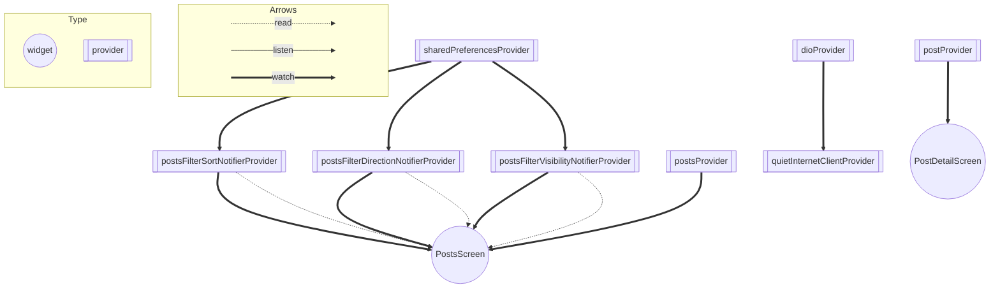

# quick_internet_client

Mobile app for https://sizu.me

## Provider Graph

```mermaid
flowchart TB
  subgraph Arrows
    direction LR
    start1[ ] -..->|read| stop1[ ]
    style start1 height:0px;
    style stop1 height:0px;
    start2[ ] --->|listen| stop2[ ]
    style start2 height:0px;
    style stop2 height:0px;
    start3[ ] ===>|watch| stop3[ ]
    style start3 height:0px;
    style stop3 height:0px;
  end
  subgraph Type
    direction TB
    ConsumerWidget((widget));
    Provider[[provider]];
  end

  postsFilterSortNotifierProvider[["postsFilterSortNotifierProvider"]];
  postsFilterDirectionNotifierProvider[["postsFilterDirectionNotifierProvider"]];
  postsFilterVisibilityNotifierProvider[["postsFilterVisibilityNotifierProvider"]];
  postsProvider[["postsProvider"]];
  postProvider[["postProvider"]];
  sharedPreferencesProvider[["sharedPreferencesProvider"]];
  quietInternetClientProvider[["quietInternetClientProvider"]];
  dioProvider[["dioProvider"]];
  PostsScreen((PostsScreen));
  PostDetailScreen((PostDetailScreen));

  postsFilterSortNotifierProvider ==> PostsScreen;
  postsFilterDirectionNotifierProvider ==> PostsScreen;
  postsFilterVisibilityNotifierProvider ==> PostsScreen;
  postsProvider ==> PostsScreen;
  postsFilterSortNotifierProvider -.-> PostsScreen;
  postsFilterDirectionNotifierProvider -.-> PostsScreen;
  postsFilterVisibilityNotifierProvider -.-> PostsScreen;
  postProvider ==> PostDetailScreen;
  sharedPreferencesProvider ==> postsFilterSortNotifierProvider;
  sharedPreferencesProvider ==> postsFilterDirectionNotifierProvider;
  sharedPreferencesProvider ==> postsFilterVisibilityNotifierProvider;
  dioProvider ==> quietInternetClientProvider;
```